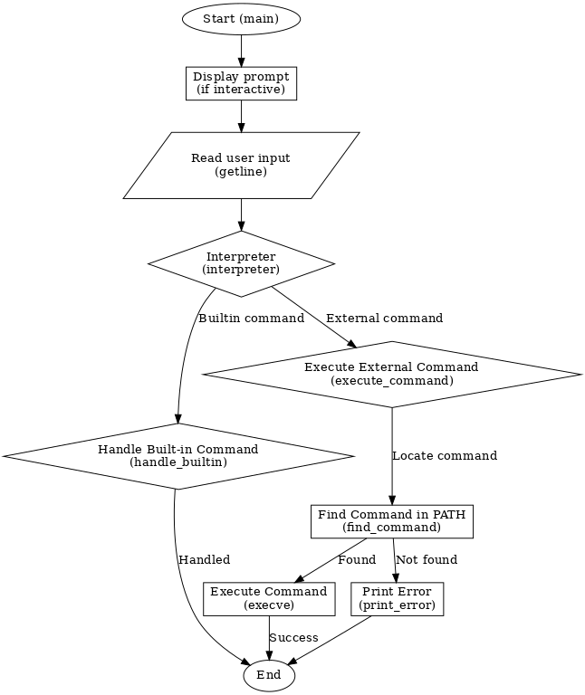

# holbertonschool-simple_shell
## Table of Contents
1. [Introduction](#introduction)
2. [Features](#features)
3. [Installation](#installation)
4. [Usage](#usage)
5. [Built-ins](#built-ins)
6. [Examples](#examples)
7. [Non-Interactive Mode](#non-interactive-mode)
8. [Contributing](#contributing)
9. [Requirements](#requirements)
10. [Flowchart](#flowchart)
11. [Man Page](#man-page)
12. [License](#license)

## Introduction
The `holbertonschool-simple_shell` is a simple UNIX command interpreter that replicates the functionality of the simple shell (sh). This project is part of the curriculum at Holberton School and aims to deepen understanding of system calls, processes, and file descriptors.

## Features
- Command execution
- Handling of built-in commands
- Input redirection
- Output redirection
- Error handling
- Environment variable management

## Installation
To install and use the simple shell, follow these steps:
1. Clone the repository:
	```sh
	git clone https://github.com/yourusername/holbertonschool-simple_shell.git
	```
2. Navigate to the project directory:
	```sh
	cd holbertonschool-simple_shell
	```
3. Compile the source files:
	```sh
	gcc -Wall -Werror -Wextra -pedantic *.c -o hsh
	```

## Usage
To start the simple shell, run the following command:
```sh
./hsh
```
You can then enter commands as you would in a standard shell. To exit the shell, use the `exit` command.

## Built-ins
The simple shell supports the following built-in commands:
- `cd`: Change the current directory.
- `env`: Print the environment variables.
- `setenv`: Set an environment variable.
- `unsetenv`: Unset an environment variable.
- `exit`: Exit the shell.

## Examples
Here are some examples of how to use the simple shell:
- Running a command:
	```sh
	$ ls -l
	```
- Changing directory:
	```sh
	$ cd /path/to/directory
	```
- Setting an environment variable:
	```sh
	$ setenv VAR_NAME value
	```
- Unsetting an environment variable:
	```sh
	$ unsetenv VAR_NAME
	```

## Non-Interactive Mode
The simple shell can also run in non-interactive mode by piping commands to it. For example:
```sh
echo "ls -l" | ./hsh
```
You can also use a file containing commands:
```sh
cat commands.txt | ./hsh
```
Where `commands.txt` contains:
```sh
ls -l
pwd
```

## Contributing
Contributions are welcome! Please follow these steps to contribute:
1. Fork the repository.
2. Create a new branch:
	```sh
	git checkout -b feature-branch
	```
3. Make your changes and commit them:
	```sh
	git commit -m "Description of changes"
	```
4. Push to the branch:
	```sh
	git push origin feature-branch
	```
5. Create a pull request.

## Requirements
### List of allowed functions and system calls
- all functions from string.h
- access (man 2 access)
- chdir (man 2 chdir)
- close (man 2 close)
- closedir (man 3 closedir)
- execve (man 2 execve)
- exit (man 3 exit)
- _exit (man 2 _exit)
- fflush (man 3 fflush)
- fork (man 2 fork)
- free (man 3 free)
- getcwd (man 3 getcwd)
- getline (man 3 getline)
- getpid (man 2 getpid)
- isatty (man 3 isatty)
- kill (man 2 kill)
- malloc (man 3 malloc)
- open (man 2 open)
- opendir (man 3 opendir)
- perror (man 3 perror)
- printf (man 3 printf)
- fprintf (man 3 fprintf)
- vfprintf (man 3 vfprintf)
- sprintf (man 3 sprintf)
- putchar (man 3 putchar)
- read (man 2 read)
- readdir (man 3 readdir)
- signal (man 2 signal)
- stat (__xstat) (man 2 stat)
- lstat (__lxstat) (man 2 lstat)
- fstat (__fxstat) (man 2 fstat)
- strtok (man 3 strtok)
- wait (man 2 wait)
- waitpid (man 2 waitpid)
- wait3 (man 2 wait3)
- wait4 (man 2 wait4)
- write (man 2 write)

## Flowchart 



## Man 


## License
This project is licensed under the MIT License. See the [LICENSE](LICENSE) file for more details.